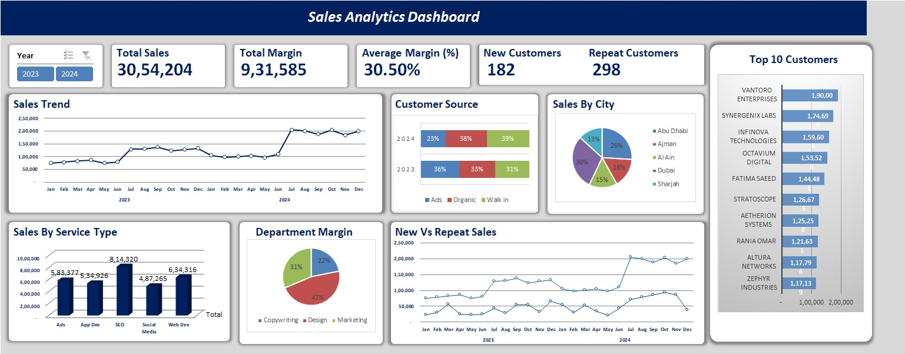

# **Sales Analytics Dashboard** 📊

## **Overview**
The **Sales Analytics Dashboard** is an interactive reporting tool built entirely in **Microsoft Excel**. It provides a detailed analysis of sales trends, customer behavior, and business performance using visual charts, pivot tables, and data analysis techniques.

## **🚀 Features**
- **Total Sales & Margins** – Track total sales, margins, and profitability
- **Sales Trend Analysis** – Monthly and yearly performance tracking
- **Customer Segmentation** – Analyze new vs. repeat customers
- **Sales by Region & Service Type** – Breakdown of sales by city and business category
- **Top 10 Customers** – Identify key revenue-generating customers
- **Dynamic Filters** – Easily switch between different years and categories

## **📊 Dashboard Preview**

## **📂 Files Included**
- `Sales_Analytics_Dashboard.xlsx` – The Excel dashboard file
- `README.md` – Documentation for the project

## **🛠️ Built Using**
- **Microsoft Excel** – Data processing, visualization, and reporting
- **Pivot Tables & Charts** – For data analysis and insights
- **Conditional Formatting** – Highlighting key trends and metrics
- **Formulas & Data Validation** – Automating calculations and interactivity

## **📥 How to Use**
1. **Download the Excel file** (`Sales_Analytics_Dashboard.xlsx`)
2. Open it in **Microsoft Excel (2016 or later)**
3. Use the **slicers/filters** to interact with the data
4. Explore the various sales trends, customer insights, and revenue analysis

## **📧 Contact & Feedback**
For any queries or suggestions, feel free to reach out:
- 📩 Email: prince.doobay@yahoo.com
- 🔗 LinkedIn: https://www.linkedin.com/in/prince-doobay/
